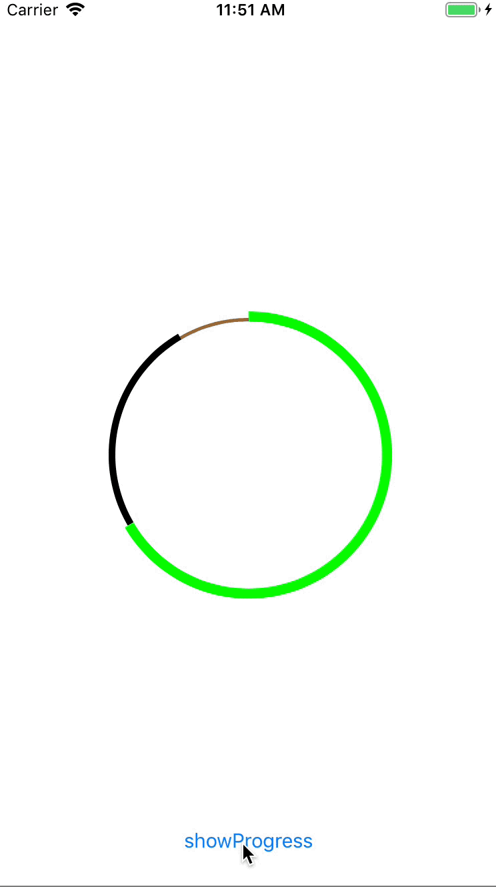

CircleProgressBar is a library for showing diffrent colors progress to a circle progress bar.

# Requirements

* iOS 9.0+

# Usage

## CocoaPods Install

## Carthage Install

# License

CircleProgressBar is released under the MIT license. See LICENSE for details.